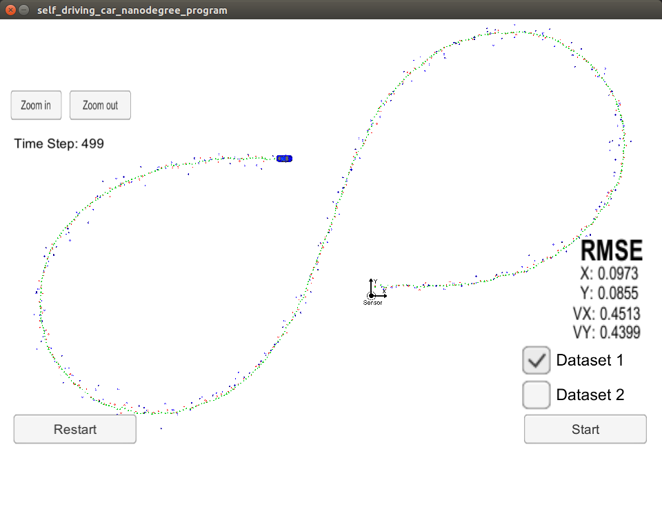
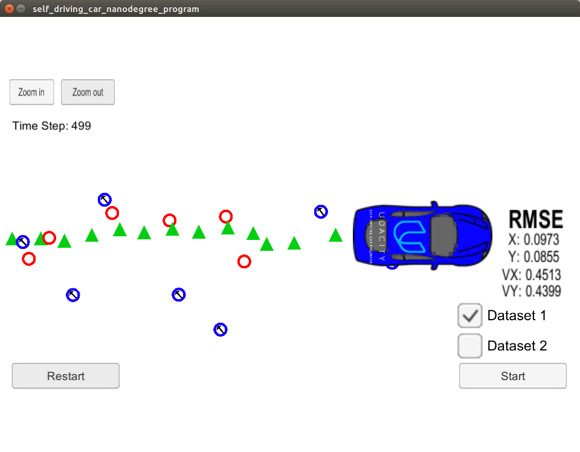
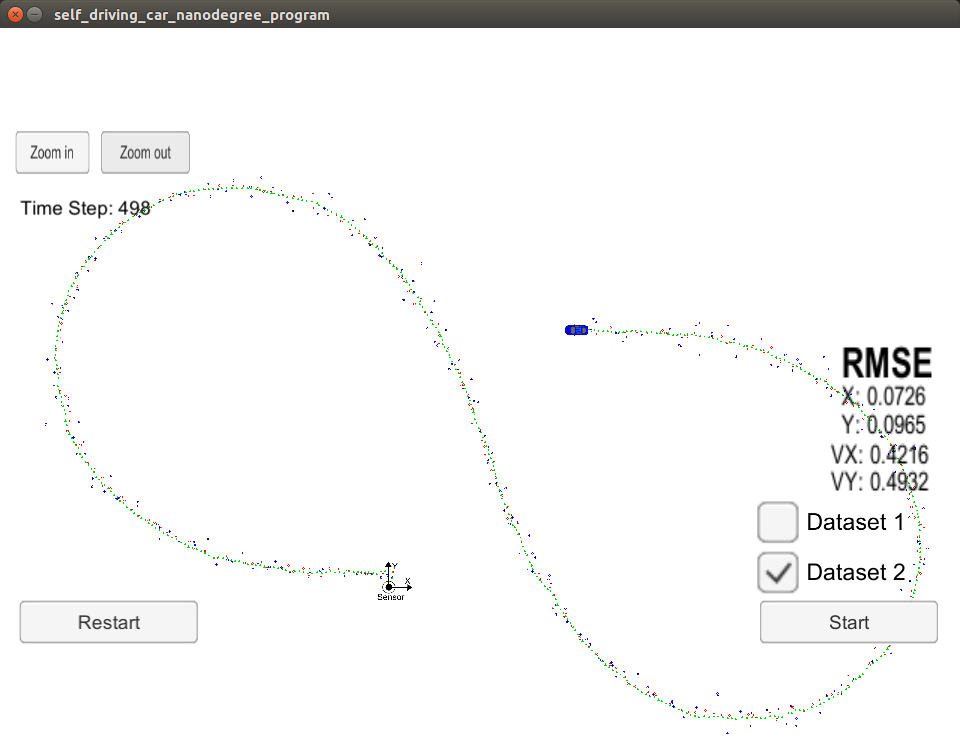
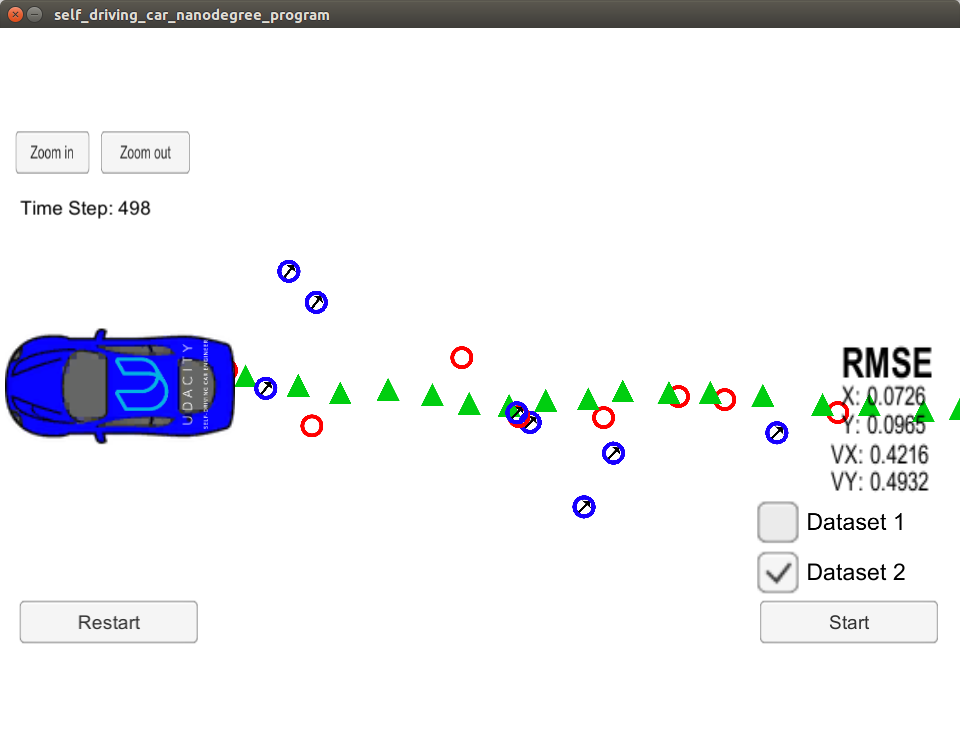

# EKF_Cman
# Submission for Term2 Project 1: Extended Kalman Filters

>Environment setup, algorithm docu and boilerplate code provided by Udacity 
under https://github.com/udacity/CarND-Extended-Kalman-Filter-Project. 
Improvements where made to:

- src/FusionEKF.cpp
- src/FusionEKF.h
- src/kalman_filter.cpp
- src/kalman_filter.h
- src/tools.cpp

In FusionEKF.cpp, __initialized__ the Kalman Filter, prepared the __Q__ and __F__ matrices for the prediction step, and called the __radar and lidar update__ functions.
In kalman_filter.cpp, filled out the __Predict(), Update(), and UpdateEKF()__ functions.
In tools.cpp, filled the functions that calculate root mean squared error (__RMSE__) and the __Jacobian matrix__.

Objective is implementing a kalman filter in C++ to estimate the state of a moving object of interest with noisy lidar and radar measurements. 
Passing the project requires obtaining RMSE values that are lower than the tolerance outlined in the project rubric, 
pls see https://review.udacity.com/#!/rubrics/748/view

This project involves the Term 2 Simulator which can be downloaded here: https://github.com/udacity/self-driving-car-sim/releases. A server package uWebSocketIO is setting up a connection from the C++ program to the simulator, which acts as the host.

## Running the project
> Basic Build Instructions
1. Clone this repo.
2. Make a build directory: mkdir build && cd build
3. Compile: cmake .. && make
4. Run it: ./ExtendedKF
5. Run and start the simulator

## Results
Lidar measurements are red circles, radar measurements are blue circles with an arrow pointing in the direction of the observed angle, and estimation markers are green triangles.

> The results Dataset 1 are:

> The results Dataset 2 are:

